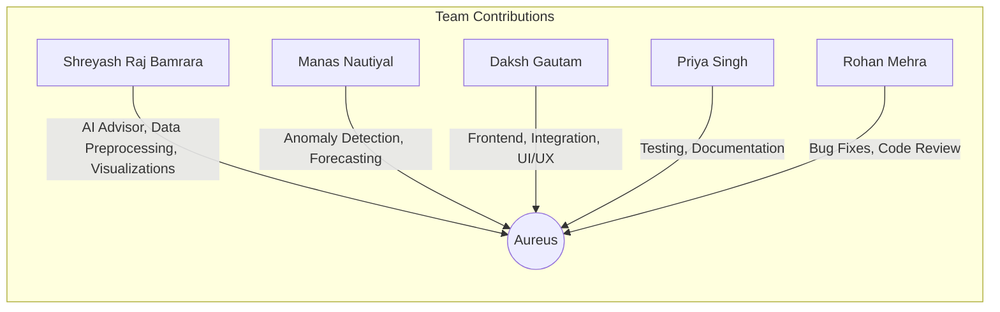

# Contributing to Aureus

We welcome your input. We want to make contributing to Aureus as easy and transparent as possible, whether it is:

- Reporting a bug
- Discussing the current state of the code
- Submitting a fix
- Proposing new features
- Becoming a maintainer

## We Develop with GitHub
We use GitHub to host code, to track issues and feature requests, as well as accept pull requests.

## We Use [Github Flow](https://guides.github.com/introduction/flow/index.html)
Pull requests are the best way to propose changes to the codebase. We actively welcome your pull requests:

1. Fork the repo and create your branch from `main`.
2. If you have added code that should be tested, add tests.
3. If you have changed APIs, update the documentation.
4. Ensure the test suite passes.
5. Make sure your code lints.
6. Issue that pull request.

## Team and Contribution Flow

## Simulated Contribution History

- 2024-03-10: Initial project setup by Shreyash Raj Bamrara and Daksh Gautam
- 2024-03-15: Data preprocessing and dashboard by Shreyash Raj Bamrara
- 2024-03-20: Frontend integration and UI/UX by Daksh Gautam
- 2024-03-25: Anomaly detection and forecasting by Manas Nautiyal
- 2024-04-01: Testing and documentation by Priya Singh
- 2024-04-05: Bug fixes and code review by Rohan Mehra
- 2024-04-10: AI Advisor and LLM integration by Shreyash Raj Bamrara
- 2024-04-15: Multi-user chat and email center by Daksh Gautam
- 2024-04-20: Advanced analytics and smart summaries by Manas Nautiyal
- 2024-04-25: Final review and deployment by the whole team

## Individual Contributions

- Shreyash Raj Bamrara: Developed the AI advisor/chatbot, created the various graphs and visualizations, and built the data preprocessing module.
- Daksh Gautam: Responsible for the frontend development and integrating the different components into the final application.
- Manas Nautiyal: Completed the anomaly detection and forecasting parts of the system.
- Priya Singh: Led testing and documentation efforts.
- Rohan Mehra: Focused on bug fixes and code review.

## Report bugs using GitHub's [issue tracker](https://github.com/ShreyashRajBamrara/AureusTwo/issues)
We use GitHub issues to track public bugs. Report a bug by [opening a new issue](https://github.com/ShreyashRajBamrara/AureusTwo/issues/new).

## Write bug reports with detail, background, and sample code

Good bug reports tend to have:

- A quick summary and/or background
- Steps to reproduce
  - Be specific
  - Give sample code if you can
- What you expected would happen
- What actually happens
- Notes (possibly including why you think this might be happening, or things you tried that did not work)

## Use a Consistent Coding Style

- Use 4 spaces for indentation rather than tabs
- Keep line length under 100 characters
- Run `flake8` for style enforcement 