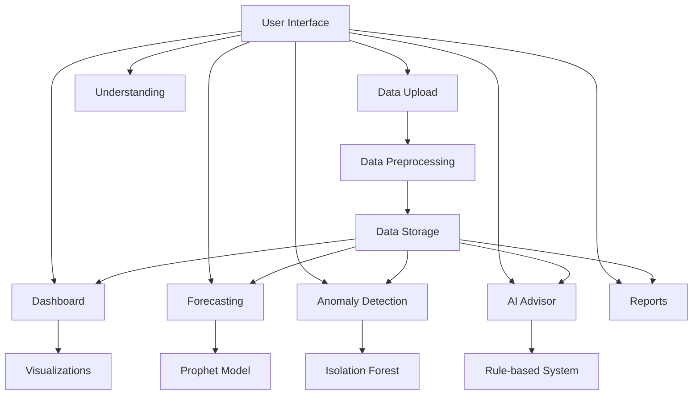

# Aureus Financial Analysis System - Technical Documentation

## Project Overview
Aureus is a comprehensive financial analysis system designed for startups and businesses to track, analyze, and forecast their financial data. The system provides intuitive visualizations, anomaly detection, and AI-powered financial advice.

## System Architecture



## Core Components

### 1. Dashboard (`components/dashboard.py`)
**Purpose**: Main visualization and analysis interface
**Key Features**:
- Time-based aggregation (Daily/Weekly/Monthly)
- Multiple visualization types
- Real-time metrics
- Interactive data exploration

**Implementation Details**:
- Uses Plotly for interactive visualizations
- Pandas for data manipulation
- Streamlit for UI components

**Limitations**:
- Memory-intensive with large datasets
- Limited to numerical and categorical data
- No real-time data updates

### 2. Forecasting (`components/forecasting.py`)
**Purpose**: Predict future financial trends
**Model**: Facebook Prophet
**Why Prophet?**:
- Handles missing data well
- Accounts for seasonality
- Provides confidence intervals
- Works well with irregular time series

**Implementation Details**:
```python
model = Prophet(
    yearly_seasonality=True,
    weekly_seasonality=True,
    daily_seasonality=True,
    interval_width=0.95
)
```

**Limitations**:
- Requires sufficient historical data
- Assumes linear growth
- May not capture sudden market changes

### 3. Anomaly Detection (`components/anomaly.py`)
**Purpose**: Identify unusual financial patterns
**Model**: Isolation Forest
**Why Isolation Forest?**:
- Efficient with high-dimensional data
- Works well with non-normal distributions
- Low computational complexity

**Implementation Details**:
```python
model = IsolationForest(
    contamination=0.1,
    random_state=42
)
```

**Limitations**:
- Requires parameter tuning
- May miss contextual anomalies
- Sensitive to data quality

### 4. AI Advisor (`components/advisor.py`)
**Purpose**: Provide financial insights and advice
**Implementation**: Rule-based system with predefined responses
**Features**:
- Topic-based response routing
- Financial term definitions
- Contextual advice generation

**Limitations**:
- Limited to predefined responses
- No learning capability
- May not handle complex queries

## Libraries Used

### 1. Streamlit (`streamlit`)
**Purpose**: Web application framework
**Why Streamlit?**:
- Rapid development
- Interactive widgets
- Easy data visualization
- Built-in caching

### 2. Pandas (`pandas`)
**Purpose**: Data manipulation and analysis
**Why Pandas?**:
- Efficient data structures
- Powerful data operations
- Time series support
- Easy data export/import

### 3. Plotly (`plotly`)
**Purpose**: Interactive visualizations
**Why Plotly?**:
- Interactive charts
- Multiple chart types
- Customizable styling
- Export capabilities

### 4. Prophet (`prophet`)
**Purpose**: Time series forecasting
**Why Prophet?**:
- Handles seasonality
- Provides confidence intervals
- Easy to use
- Good documentation

### 5. Scikit-learn (`scikit-learn`)
**Purpose**: Machine learning algorithms
**Why Scikit-learn?**:
- Comprehensive ML tools
- Well-documented
- Efficient implementations
- Active community

## Data Flow

1. **Data Input**
   - CSV file upload
   - Data validation
   - Preprocessing

2. **Data Processing**
   - Aggregation
   - Feature engineering
   - Anomaly detection

3. **Analysis**
   - Dashboard generation
   - Forecasting
   - Pattern detection

4. **Output**
   - Visualizations
   - Reports
   - Alerts

## Best Practices

1. **Data Management**
   - Regular backups
   - Data validation
   - Error handling

2. **Performance**
   - Caching where appropriate
   - Efficient data structures
   - Optimized queries

3. **Security**
   - Input validation
   - Error handling
   - Secure data storage

## Future Improvements

1. **Technical**
   - Real-time data updates
   - Machine learning integration
   - API integration

2. **Features**
   - Custom report generation
   - Advanced analytics
   - Mobile support

3. **User Experience**
   - More interactive visualizations
   - Customizable dashboards
   - Enhanced filtering

## Usage Guide

1. **Setup**
   ```bash
   pip install -r requirements.txt
   streamlit run app.py
   ```

2. **Data Upload**
   - Use the Data Upload page
   - Follow the CSV format
   - Validate data

3. **Analysis**
   - Use Dashboard for overview
   - Check Forecasting for trends
   - Monitor Anomalies
   - Consult AI Advisor

4. **Reports**
   - Generate periodic reports
   - Export data
   - Share insights

## Troubleshooting

1. **Common Issues**
   - Data format errors
   - Memory limitations
   - Performance issues

2. **Solutions**
   - Check data format
   - Optimize data size
   - Use caching

## Contributing

1. **Development**
   - Follow PEP 8
   - Add documentation
   - Write tests

2. **Testing**
   - Unit tests
   - Integration tests
   - Performance tests

## Resources

1. **Documentation**
   - Streamlit docs
   - Pandas docs
   - Prophet docs

2. **Learning**
   - Online courses
   - Tutorials
   - Community forums 