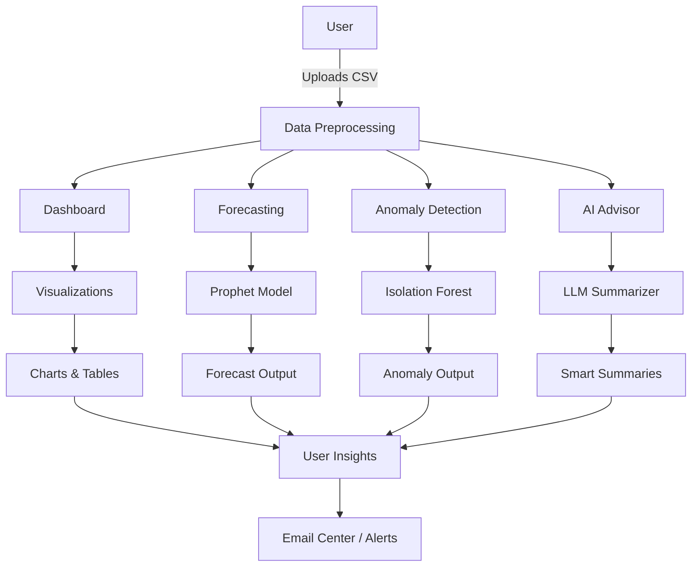
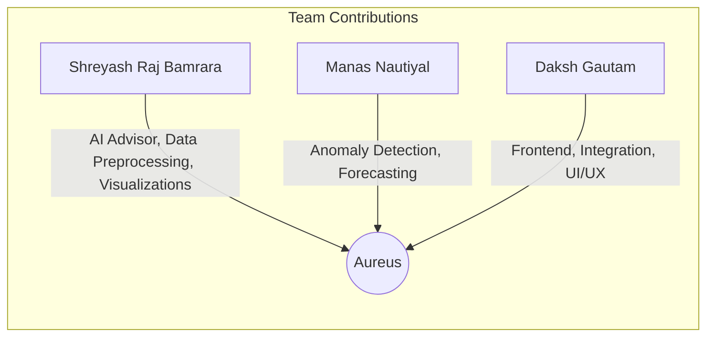
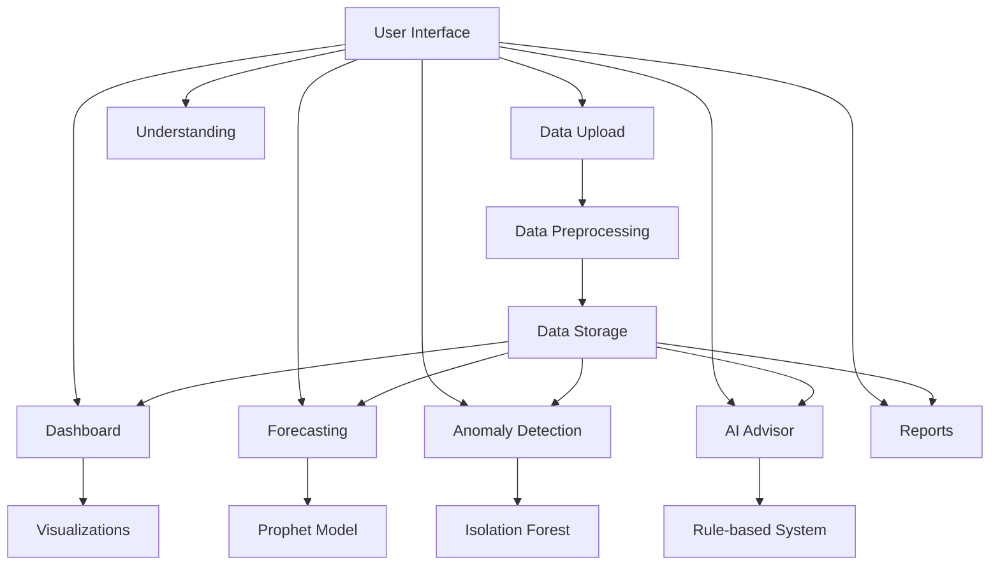

# Aureus Financial Analysis System - Technical Documentation

## Project Overview
Aureus is a financial analysis system designed for startups and businesses to track, analyze, and forecast their financial data. The system provides visualizations, anomaly detection, and AI-powered financial advice. The project is collaboratively developed by a multi-disciplinary team.

## System Flowchart



## Team Contributions



## System Architecture (Legacy)



## Core Components

### Dashboard (`components/dashboard.py`)
- Main visualization and analysis interface
- Interactive, real-time metrics and charts

### Forecasting (`components/forecasting.py`)
- Predicts future financial trends using Prophet
- Visualizes confidence intervals and trends

### Anomaly Detection (`components/anomaly.py`)
- Identifies unusual financial patterns using Isolation Forest
- Presents anomalies in a user-friendly table

### AI Advisor (`components/advisor.py`)
- LLM-powered chatbot for financial queries
- Generates smart, context-aware summaries for dashboard, forecasting, and anomaly detection
- Integrates with Ollama (TinyLlama) for local, private LLM inference

## Data Flow

1. Data input: CSV upload, validation, preprocessing
2. Processing: Aggregation, feature engineering, anomaly detection
3. Analysis: Dashboard, forecasting, pattern detection, LLM summaries
4. Output: Visualizations, smart summaries, alerts, email notifications

## Best Practices
- Data validation and regular backups
- Efficient, modular code structure
- Consistent code style and documentation

## Future Improvements
- Real-time data updates
- Advanced analytics and custom reports
- More LLM-powered features

## Libraries Used

### 1. Streamlit (`streamlit`)
**Purpose**: Web application framework
**Why Streamlit?**:
- Rapid development
- Interactive widgets
- Easy data visualization
- Built-in caching

### 2. Pandas (`pandas`)
**Purpose**: Data manipulation and analysis
**Why Pandas?**:
- Efficient data structures
- Powerful data operations
- Time series support
- Easy data export/import

### 3. Plotly (`plotly`)
**Purpose**: Interactive visualizations
**Why Plotly?**:
- Interactive charts
- Multiple chart types
- Customizable styling
- Export capabilities

### 4. Prophet (`prophet`)
**Purpose**: Time series forecasting
**Why Prophet?**:
- Handles seasonality
- Provides confidence intervals
- Easy to use
- Good documentation

### 5. Scikit-learn (`scikit-learn`)
**Purpose**: Machine learning algorithms
**Why Scikit-learn?**:
- Comprehensive ML tools
- Well-documented
- Efficient implementations
- Active community

## Usage Guide

1. **Setup**
   ```