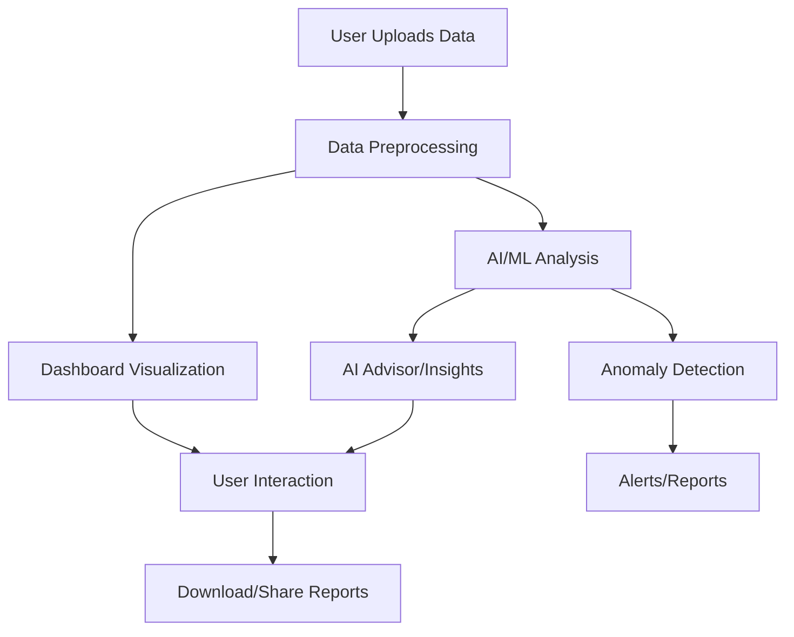

# Aureus: Company Expenditure Analysis Dashboard

---

## Table of Contents
1. [Project Implementation in Real Life](#project-implementation-in-real-life)
2. [Advantages Compared to Other Solutions](#advantages-compared-to-other-solutions)
3. [Limitations](#limitations)
4. [Definitions, Intuition, and Technology Choices](#definitions-intuition-and-technology-choices)
5. [Library and Function Descriptions](#library-and-function-descriptions)
6. [Library Definitions and Usage](#library-definitions-and-usage)
7. [Project Flowchart](#project-flowchart)

---

## Project Implementation in Real Life

Aureus is designed to be deployed within a company's IT infrastructure or on the cloud. The typical workflow is as follows:

1. **Data Ingestion:** Finance teams upload or connect their expenditure data (CSV, database, or API).
2. **Automated Analysis:** The system processes the data, detects anomalies, and generates insights using AI/ML models.
3. **Interactive Dashboard:** Users interact with dashboards to explore company, department, and employee-level spending.
4. **AI Advisor:** Users can ask questions or request recommendations for cost optimization.
5. **Reporting:** The system generates reports and can send alerts for detected anomalies.

**Example Use Case:**
- A finance manager uploads monthly expense data.
- The dashboard highlights a sudden spike in travel expenses for a department.
- The AI advisor suggests reviewing vendor contracts.
- An anomaly is detected in an employee's expense claim, triggering an alert.
- A report is generated for the CFO.

---

## Advantages Compared to Other Solutions

- **AI-Powered Insights:** Unlike traditional dashboards, Aureus uses machine learning and LLMs for deeper, contextual insights.
- **Anomaly Detection:** Automated detection of unusual spending patterns reduces manual review.
- **User-Friendly:** Streamlit provides an intuitive, interactive interface.
- **Customizable:** Modular design allows easy extension and integration.
- **Open Source:** No vendor lock-in; can be tailored to specific business needs.

**Comparison Table:**

| Feature                | Aureus         | Excel/Manual | Power BI/Tableau |
|------------------------|----------------|--------------|------------------|
| AI Insights            | Yes            | No           | Limited          |
| Anomaly Detection      | Yes            | No           | Add-on           |
| Real-time Interaction  | Yes            | No           | Yes              |
| Customization          | High           | High         | Medium           |
| Cost                   | Free/Open      | Varies       | License Required |

---

## Limitations

- **Data Quality:** Requires clean, structured data for best results.
- **Resource Intensive:** AI/ML models and LLMs may require significant computational resources.
- **Integration:** May need custom connectors for some enterprise systems.
- **Python Ecosystem:** Primarily designed for Python environments.
- **Security:** Sensitive financial data requires proper security and access controls.

---

## Definitions, Intuition, and Technology Choices

- **Anomaly Detection:** Identifying data points that deviate significantly from the norm. Used to catch fraud, errors, or unusual spending.
- **LLM (Large Language Model):** AI models (like GPT, Llama) that understand and generate human language. Used for natural language insights and recommendations.
- **Dashboard:** A visual interface for monitoring key metrics and trends.
- **Why Streamlit?** Rapid prototyping, easy deployment, and interactive UI for data apps.
- **Why Pandas?** Powerful data manipulation and analysis.
- **Why Plotly?** Interactive, publication-quality visualizations.
- **Why Scikit-learn?** Reliable, well-documented machine learning algorithms.
- **Why Ollama?** Local, private LLM inference for sensitive data.

---

## Library and Function Descriptions

### Libraries
- **streamlit:** Web app framework for building dashboards.
- **pandas:** Data analysis and manipulation.
- **plotly:** Interactive charts and graphs.
- **scikit-learn:** Machine learning (e.g., anomaly detection).
- **requests:** HTTP requests (for API/LLM integration).
- **dotenv:** Loads environment variables from .env files.

### Crucial Functions/Modules
- **load_company_data:** Loads and preprocesses company-level data.
- **generate_company_metrics:** Calculates KPIs.
- **create_expenditure_trends:** Visualizes trends.
- **analyze_department_spending:** Department analysis.
- **track_employee_expenses:** Employee-level tracking.
- **analyze_spending_patterns:** AI/ML pattern recognition.
- **detect_anomalies:** ML-based anomaly detection.
- **generate_recommendations:** LLM-powered suggestions.

---

## Library Definitions and Usage

### 1. Dashboard
- **streamlit**:  
  *Definition*: A Python library for building interactive web apps.  
  *Usage*: Renders the dashboard UI, handles user input, and displays charts and tables.

- **pandas**:  
  *Definition*: A data analysis and manipulation library.  
  *Usage*: Loads, cleans, and processes expenditure data for visualization.

- **plotly**:  
  *Definition*: A library for interactive data visualizations.  
  *Usage*: Creates dynamic charts and graphs for the dashboard.

### 2. AI Advisor
- **scikit-learn**:  
  *Definition*: A machine learning library for Python.  
  *Usage*: Runs anomaly detection and pattern recognition on expenditure data.

- **requests**:  
  *Definition*: A library for making HTTP requests.  
  *Usage*: Connects to external APIs or LLMs for AI-powered insights.

- **dotenv**:  
  *Definition*: Loads environment variables from a `.env` file.  
  *Usage*: Manages API keys and configuration securely.

### 3. Analysis & Report
- **pandas**:  
  *Usage*: Aggregates and analyzes data for reports.

- **plotly**:  
  *Usage*: Visualizes analysis results in reports.

- **scikit-learn**:  
  *Usage*: Provides predictive analytics and forecasting.

---

## Project Flowchart

Below is a Mermaid diagram showing the flow of the Aureus project.

---

*For more details, see the [GitHub repository](https://github.com/ShreyashRajBamrara/Aureus).* 