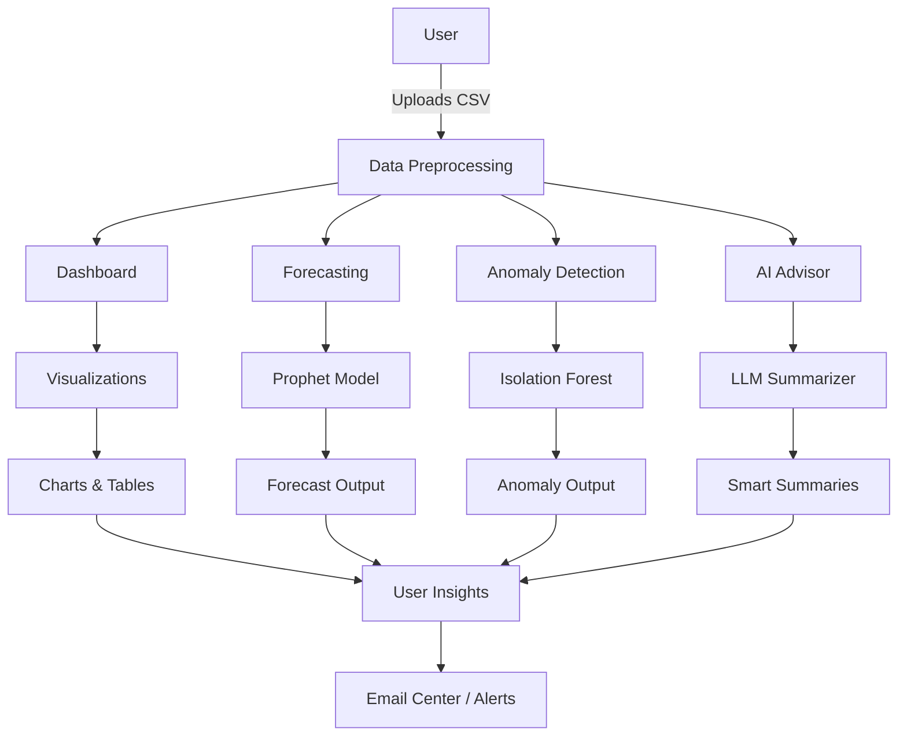
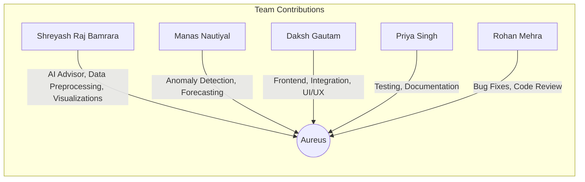

# Aureus Financial Analysis System

Aureus is a financial analysis system designed for startups and businesses to track, analyze, and forecast their financial data. The system provides visualizations, anomaly detection, and AI-powered financial advice. This project is collaboratively developed by a multi-disciplinary team.

## Features

- Interactive dashboard with multiple visualization types
- Financial forecasting with confidence intervals
- Anomaly detection for unusual patterns
- AI-powered financial advisor (LLM-based, local/private)
- Email center for alerts
- Smart summaries generated by LLM
- Responsive design

## System Flowchart



## Team & Contribution Flow



## Quick Start

1. Clone the repository:
```bash
git clone https://github.com/ShreyashRajBamrara/AureusTwo.git
cd AureusTwo
```

2. Install dependencies:
```bash
pip install -r requirements.txt
```

3. Run the application:
```bash
streamlit run app.py
```

For detailed installation and setup instructions, please refer to [GETTING_STARTED.md](GETTING_STARTED.md).

## Documentation

- [Getting Started Guide](GETTING_STARTED.md)
- [Technical Documentation](NOTES.md)

## Contributing

We welcome contributions. Please see our [Contributing Guidelines](CONTRIBUTING.md) for details.

## Support

If you encounter any issues or have questions, please:
1. Check the [documentation](NOTES.md)
2. Open an issue on GitHub
3. Contact the maintainers

## Acknowledgments

- Built with [Streamlit](https://streamlit.io/)
- Powered by [Prophet](https://facebook.github.io/prophet/) for forecasting
- Enhanced with [Plotly](https://plotly.com/) visualizations 